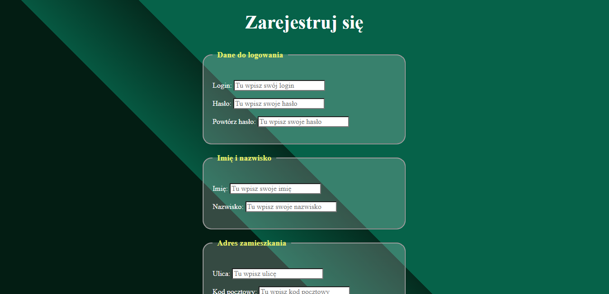
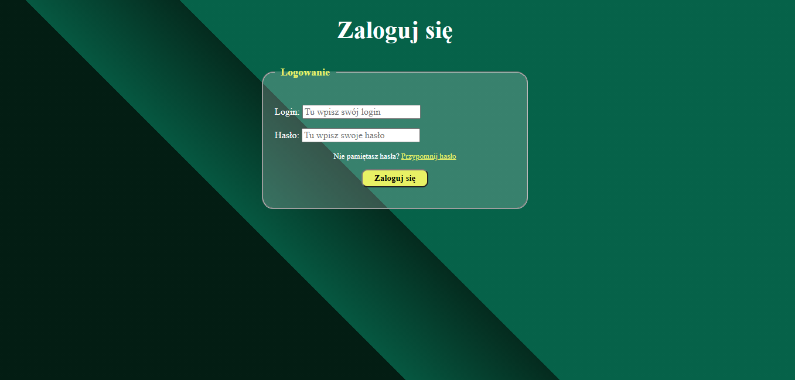

# Registration and log in form

## Table of contents

- [Overview](#overview)
  - [Screenshot](#screenshot)
  - [Links](#links)
- [My process](#my-process)
  - [Built with](#built-with)
  - [What I learned](#what-i-learned)

## Overview

I created a simple registration form and a page with a login field. I haven't used any database here, it's just a visual design.
The project was created while going through the course: WTF - Co ten frontend. Led by Maciek Korsan.

### Screenshot

### Links

- Live Site URL with registration form: (https://karbowskam.github.io/registration-form/index.html)
- Live Site URL with log in field: (https://karbowskam.github.io/registration-form/log-in.html)

## My process

### Built with

- HTML
- CSS custom properties
- Java Script

### What I learned

I learned how to easily create a form. I got to know the attributes of input and used the select and option tags to create the possibility for the user to choose the province.
I also learned how to change HTML text using Java Script.